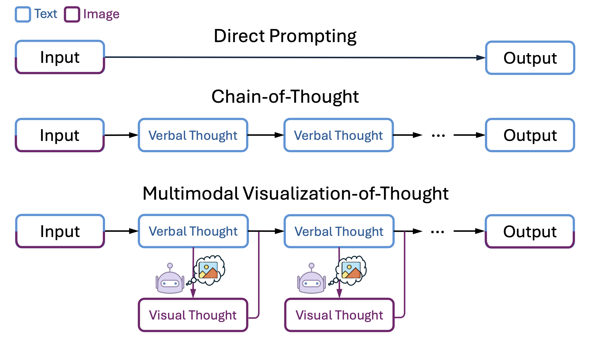
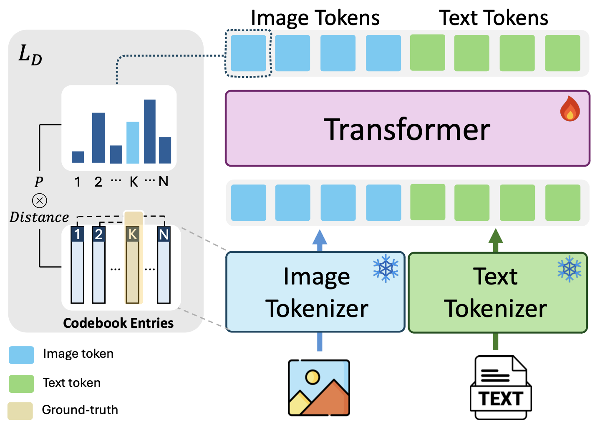
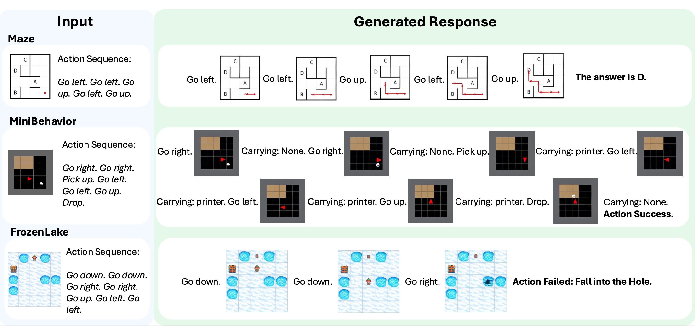

# PyTorch Implementation of MVoT

This is the PyTorch implementation of the MVoT paper: [**Imagine While Reasoning in Space: Multimodal Visualization-of-Thought**](https://arxiv.org/abs/2501.07542)

Authors: Chengzu Li*, Wenshan Wu*, Huanyu Zhang, Yan Xia, Shaoguang Mao, Li Dong, Ivan Vulić, Furu Wei. (\* equal contribution)

---

## 🌟 Overview

Multimodal Visualization-of-Thought (MVoT) is a novel reasoning strategy that enables reasoning with **native multimodal traces** in the context of spatial reasoning. 
It generates **explicit visual thoughts** through autoregressive generation and optimizes the visualization quality via **token discrepancy loss**.

<p align="center">
  
  
</p>

MVoT boosts spatial reasoning performance across a variety of tasks and models, and establishes new possibilities for complex tasks where visual thinking effectively complements verbal reasoning.

<p align="center">
  
</p>

---

## 🧠 Key Contributions

- 🔍 **Multimodal Visualization-of-Thought**: a multimodal native reasoning paradigm that unifies text and vision within the reasoning traces.
- 🖼️ **Token Discrepancy Loss**: for auto-regressive MLLM to bridge the gap between separately trained tokenizer.
- 📊 Strong empirical performance across multiple dynamic spatial reasoning tasks.
---

## 🛠️ Installation

```bash
git clone https://github.com/chengzu-li/MVoT.git
cd MVoT
conda create -n mvot python=3.10
conda activate mvot
pip install torch==2.4.0
pip install -r requirements.txt --user
```

---

## 🚀 Usage

### Data

Only partial datasets are released for the purpose of debugging and illustrating data format. Should there be any further inquiries regarding the data, please get in touch with the authors. 

```bash
unzip data_samples.zip
```


### Training MVoT with Anole

#### Single Node with Multiple GPUs
```
torchrun --nproc_per_node 1 train.py \
--model anole \
--data interleaved_maze \
--decoder_type anole \
--image_seq_length 1024 \
--input_format anole \
--output ./output \
--note ybqtry \
--report_to none \
--do_train \
--do_eval
```

#### Multiple Nodes with Multiple GPUs

```
torchrun --nnodes <NODE_NUM> --nproc_per_node <GPU_NUM_PER_NODE> --node_rank $RANK --master_addr $MASTER_ADDR --master_port $MASTER_PORT train.py \
--model anole \
--data frozenlake \
--decoder_type anole \
--image_seq_length 1024 \
--input_format anole \
--output <OUTPUT_PATH> \
--note <NOTE> \
--report_to none \
--do_train \
--do_eval
```

* <GPU_NUM>, <NODE_NUM>, <OUTPUT_PATH>, \<NOTE\> specified depending on your circumstances. 

## 📜 Citation

If you find this work useful, please consider citing:
```
@misc{li2025imaginereasoningspacemultimodal,
      title={Imagine while Reasoning in Space: Multimodal Visualization-of-Thought}, 
      author={Chengzu Li and Wenshan Wu and Huanyu Zhang and Yan Xia and Shaoguang Mao and Li Dong and Ivan Vulić and Furu Wei},
      year={2025},
      eprint={2501.07542},
      archivePrefix={arXiv},
      primaryClass={cs.CL},
      url={https://arxiv.org/abs/2501.07542}, 
}
```